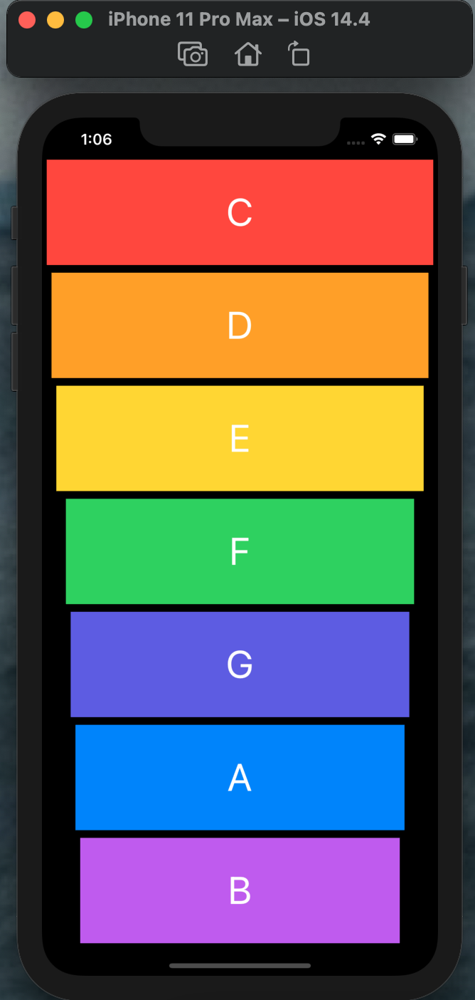

⚠️ Feel free to download source code and change it by your own.

<h2>☑️ What is this app about?</h2>

 Musical instrument! Music apps are so popular on the App Store that they even get their own category. So in this app, I made a colourful XyloPhone app.

<h2>☑️ What have I learned?</h2>
<ul>
  <li>How to play sound using AVFoundation and AVAudioPlayer.</li>
  <li>Understanding Apple documentation and how to use StackOverflow.</li>
  <li>Functions and methods in Swift. </li>
  <li>Data types.</li>
  <li>Swift loops.</li>
  <li>Variable scope.</li>
  <li>The ViewController lifecycle.</li>
  <li>Error handling in Swift.</li>
  <li>Code refactoring.</li>
  <li>Basic debugging.</li>
</ul>
<h2>☑️ Final look of Xylophone app🎶</h2>

